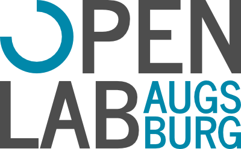

# OpenLab Logo
Dieser Ordner beinhaltet das Signet und zwei Logovarianten als Vektorgrafiken. 
Das Logo setzt sich aus Signet und Text in der Schriftart News Cycle Bold
zusammen. Bitte verwende möglichst immer die Dateien ohne Schriftartabhängigkeit
(\*_pathed.svg), vorallem zur direkten Veröffentlichung als svg!

In [rendered](rendered) befinden sich zudem noch gerenderte Logo-Grafiken als .png.

### Farben
* Blau #0088aa (CMYK: 100 20 0 33)
* Grau #4d4d4d (CMYK: 0 0 0 70)

### Signet

### Logo standard

### Logo einzeilige Variante

